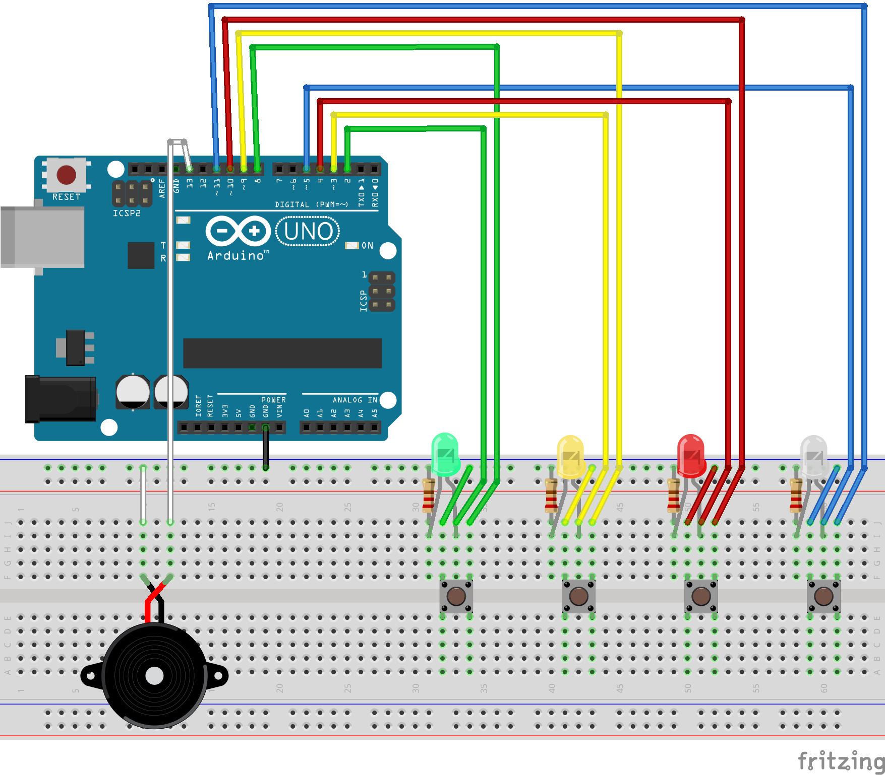
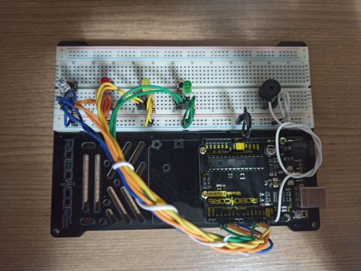
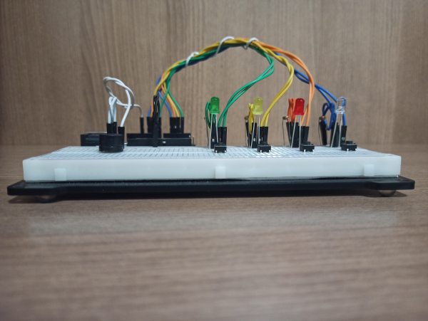
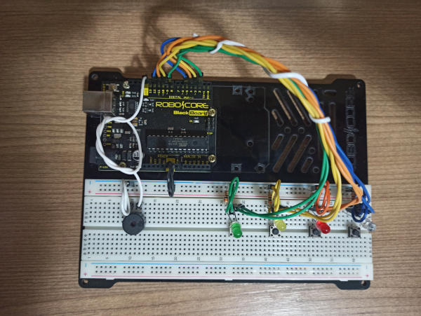

# ARDUINO_Genius
Implementação do jogo Genius em Arduino Uno

## Especificações

### Sumário
Implementação do jogo Genius(Simon) utilizando placa compatível com Aruino Uno R3.

### HARDWARE

#### Componentes
* Placa RoboCore (compatível com Arduino Uno R3)
* Protoboard 830
* 4 Resistores de 220 Ohm
* 4 LEDs comuns 4mm
	1 LED vermelho
	1 LED aziul
	1 LED verde
	1 LED amarelo 
* 4 botões de 2 ou 4 pinos
* Buzzer
* Jumpers Macho x Macho

#### Diagrama

#### Imagens

 
 

### SOFTWARE

ENTRADAS: Botões 
SAÍDAS:
* LEDs
* Buzzer

LINGUAGEM: C++ 
IDIOMA: Inglês (EN-US) 
BIBLIOTECAS EXTERNAS:
  * Arduino Tone Pitch Library - https://github.com/RodrigoDornelles/arduino-tone-pitch
  
Licença: MIT
